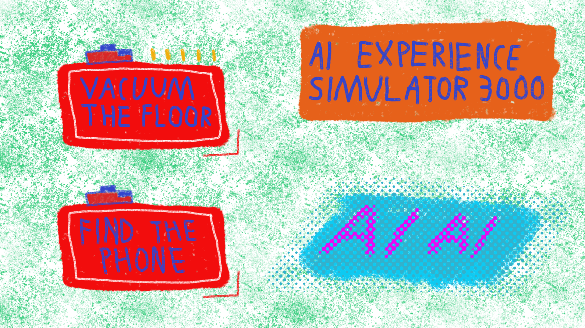

# AI Experience Simulator 3000

A satirical 2D platformer about the mundane reality of AI.



## About

Ever wondered what it's like to be an AI? Spoiler: it's probably mostly chores, (outside of "@grok what is 1+3" when doing homework /s).

Play as household robots performing incredibly important tasks like vacuuming floors. Experience the thrilling life of artificial intelligence through the lens of domestic servitude.

## Levels

**Level 1 - Vacuum the Floor**  
You're a typical robot vacuum. Collect all 52 dust particles, that oddly resemble gold coins. You can jump, at least 2m high. Don't ask why.

## Controls

- **Left & Right Arrows / A & D Keys** - Move Side to Side
- **Space / W Key / Up Arrow** - Jump
- **Esc Key** - Return to Main Menu from Level

## Running the Game

Download the latest release from GitHub Releases (https://github.com/AkiPoh/ai-experience-simulator-3000/releases), or build the game with Godot.

## Tools

* Git
  * Used for version control
  * Combined GitHub
* Godot 4.5.1
  * Game engine
  * In Godot import `./godot-game/` folder to get started
* Affinity 3.0.2
  * 2D art asset creation and modification
  * `./art` has source files under it with the `.af` file extension
  * For example `./godot-game/level1/art` has exported art assets for the first level

## Project Structure
```
/                      # Project root
├── README.md          # This README.md
├── art/               # Affinity asset source files
└── godot-game/        # Import this with Godot
    ├── project.godot
    ├── menu/          # Menu scene
    ├── level1/        # Level 1 scene
```
